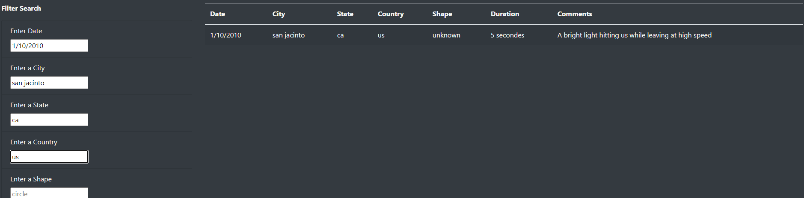

# UFOs

## Overview of Project
Dana’s has a webpage with a dynamic table working as intended, but she’d like to provide a more in-depth analysis of UFO sightings by allowing users to filter for multiple criteria at the same time. In addition to the current datefilter, we'll be adding table filters for the city, state, country, and shape.

## Results
It's fairly simple to use the search options on the page, to do a single search you just need to type into the box one of the options that appears in the table and then either hit 'enter' or click off the input box. In the example below I've typed '1/10/2010' into the 'Enter Date' filter:

And if you want to get even more granular you can do the same with multiple boxes. In the below example I've input '1/10/2010' into 'Enter Date', 'san jacinto' into 'Enter a City', 'ca' into 'Enter a State' and 'us' into 'Enter a Country':

## Summary
A drawback to this current design is it's a little exact, if you type in the city name with capitals for example, it won't be able to find the city since it's looking for the specific lowercase string. To fix that we could make a filter function more dynamic using regex to match lower case and upper case.

Another improvement we could implement is making a dropdown for each filter, pulling all the different options dynamically and adding them to a dropdown list so you can select an option without needing to worry about typing the exact string. This might not be a good idea for city, but for state/country/shape it should work well.
